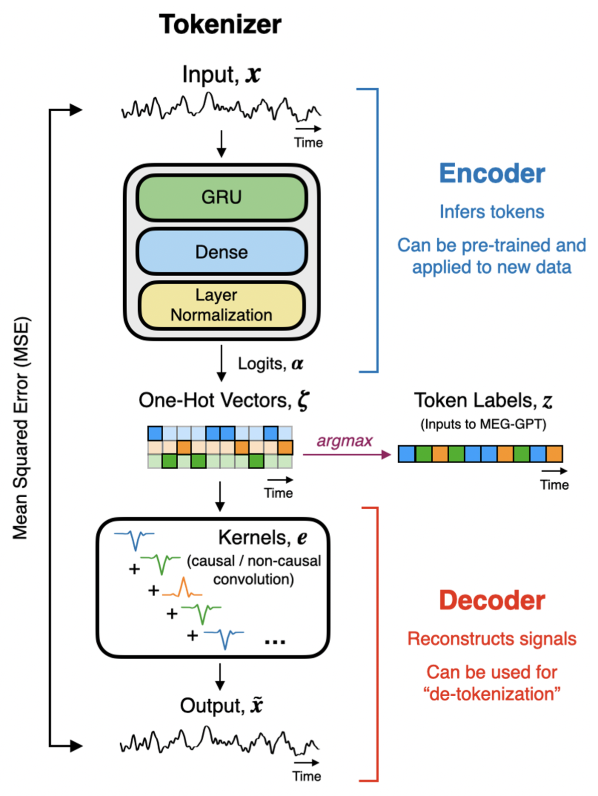

# EphysTokenizer

**EphysTokenizer** is a data-driven, sample-level tokenizer for non-invasive human electrophysiological signals (MEG/EEG). It discretizes continuous neural time series into integer token sequences at each time step. By training an autoencoder with an RNN-based encoder and a convolutional decoder, the model learns a quantization scheme through signal reconstruction, enabling end-to-end tokenization directly from raw time-domain samples.

<div align="center">
    
    <p><strong>Overview of the EphysTokenizer Architecture</strong></p>
</div>

In addition, this repository also provides baseline tokenization methods based on fixed scaling and binning strategies for controlled comparison.

🙋‍♂️ Please email SungJun Cho at sungjun.cho@ndcn.ox.ac.uk or simply open a GitHub issue if you have any questions or concerns.

## Table of Contents

- [Requirements](#-requirements)
- [Installation](#-installation)
- [Quick Start](#️-quick-start)
- [Project Structure](#-project-structure)
- [Citation](#-citation)

## 🎯 Requirements

This project has the following dependencies:

* python=3.10
* pytorch=2.5.1
* pytorch-cuda=12.1
* pytorch-lightning=2.6.1

For a full list of required packages, please refer to `envs/etkn.yml`.

## 📌 Installation

To install `EphysTokenizer`, you can follow the steps below:

1. Clone the repository.
   ```bash
   git clone git@github.com:OHBA-analysis/EphysTokenizer.git
   cd EphysTokenizer
   ```
2. Create and activate a virtual environment.
   ```bash
   mamba env create -f envs/etkn.yml
   conda activate etkn
   ```
3. Install required packages.
   ```bash
   pip install -e .
   ```

> [!WARNING]
> Loading the Cam-CAN dataset as a PyTorch `Dataset` currently requires the `pnpl` and `pnpl-internal` packages.
> We are in the process of restructuring these packages, and `pnpl-internal` is not yet publicly available.
> An updated version of `pnpl` will be released soon. Meanwhile, users may integrate their own datasets and data loaders.

## ⚡️ Quick Start

The fastest way to get started is to review the example scripts in the `examples` directory.

You can train `EphysTokenizer` on 50 subjects from the resting-state, source-space Cam-CAN dataset by running:

```bash
python train_etkn.py
```

To employ the baseline models (`MuTransformTokenizer` or `StandardQuantileTokenizer`), use:

```bash
python train_baseline.py \
    --config-path {ex_mu, ex_sq} \
    --config-name config
```

These scripts demonstrate how to configure, train, and evaluate the models. Each run generates a `figures` subdirectory containing basic post hoc analysis outputs.

### Tokenizing & detokenizing a recording

Once you have a trained model, tokenise a continuous recording with `tokenize_session` and reconstruct it with `reconstruct_session`:

```python
from ephys_tokenizer.models.ephys_tokenizer import EphysTokenizerModule

model = EphysTokenizerModule.load_model(run_dir)   # a trained-model directory

# signal: a continuous (n_samples, n_channels) array
tokens = model.tokenize_session(signal)            # -> (n_samples, n_channels) uint token stream
recon  = model.reconstruct_session(tokens)         # -> reconstructed signal
```

## 📚 Project Structure

```
EphysTokenizer-main/
├── envs/
│   └── etkn.yml                  # Conda environment specification (dependencies for training and experiments)
│
├── ephys_tokenizer/
│   ├── configs/
│   │   └── config.py             # Configuration object (hyperparameters, model settings)
│   │
│   ├── data/
│   │   └── dataloader.py         # DataLoader logic for electrophysiology signals
│   │                             # (batching, train/val/test split)
│   │
│   ├── models/
│   │   ├── callbacks.py          # Training callbacks (logging, checkpointing, metrics, schedulers)
│   │   ├── ephys_tokenizer.py    # Main tokenizer model definition (EphysTokenizer)
│   │   ├── layers.py             # Reusable neural network components
│   │   ├── mu_transform.py       # Baseline tokenizer (μ-transform tokenizer module)
│   │   └── standard_quantile.py  # Baseline tokenizer (standardisation + quantile binning)
│   │
│   └── utils/
│       ├── initializer.py        # Model weight initialization utilities
│       ├── plotting.py           # Visualization utilities
│       └── train.py              # Model training utilities
│
└── examples/
    ├── ex_etkn/
    │   └── config.yaml           # YAML config for EphysTokenizer experiment
    │
    ├── ex_mu/
    │   └── config.yaml           # YAML config for μ-transform experiment
    │
    ├── ex_sq/
    │   └── config.yaml           # YAML config for standard quantile experiment
    │
    ├── train_baseline.py         # Example script for baseline tokenizers
    ├── train_etkn.py             # Example training script for EphysTokenizer
    └── tokenize_etkn.py          # Example: tokenise + detokenise a recording
```

## 📑 Citation

If you find this work helpful, please cite the following paper:

```bibtex
@article{Cho2026,
    title={A Systematic Evaluation of Sample-Level Tokenization Strategies for MEG Foundation Models},
    author={SungJun Cho, Chetan Gohil, Rukuang Huang, Oiwi Parker Jones, Mark W. Woolrich},
    journal={arXiv preprint arXiv:2602.16626},
    year={2026},
    url={https://arxiv.org/pdf/2602.16626},
}
```

For the `EphysTokenizer` with non-causal convolution kernels, please also cite:
```bibtex
@article{Huang2025,
    title={{MEG-GPT}: A transformer-based foundation model for magnetoencephalography data},
    author={Rukuang Huang, Sungjun Cho, Chetan Gohil, Oiwi Parker Jones, Mark Woolrich},
    journal={arXiv preprint arXiv:2510.18080},
    year={2025},
    url={https://arxiv.org/pdf/2510.18080},
}
```
